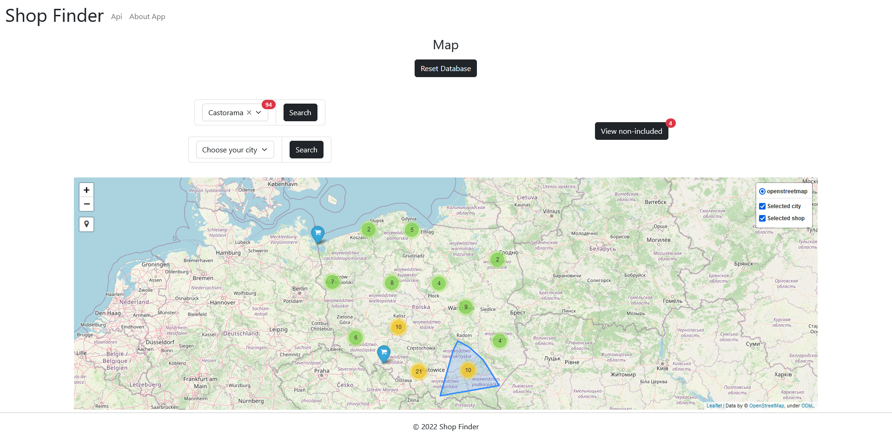

# Shop Finder
> Shop Finder is an application that allows you to search and display all the stores across Poland.
> Live demo [_here_](https://www.example.com). 

## Table of Contents
* [General Info](#general-information)
* [Technologies Used](#technologies-used)
* [Features](#features)
* [Screenshots](#screenshots)
* [Setup](#setup)
* [Project Status](#project-status)
* [Acknowledgements](#acknowledgements)
* [Contact](#contact)


## General Information
- This application allow you to search among 70,000 addresses of well-known companies in Poland.
- The goal of this project was to polish skills and make something functional, useful to everyone.
- A small number of addresses may have been incorrectly processed by a poor-quality geocoder, but all the database content is correct and has the correct addresses.
- You can see the list of shops used by this program in Available_shops.txt

## Technologies Used
- Django - 4.0
- Django Rest Framework - 3.14.0


## Features
- You can choose between searching by a shop name or a city
- You can reset the database and load new data
- You can use free API


## Screenshots



## Setup
If you want to open project locally: 

```
$ cd ../Mapproject
$ python -m venv env 
$ env\Scripts\activate
$ python -m pip install -r requirements.txt
$ python manage.py makemigrations
$ python manage.py migrate
$ python manage.py runserver
```


## Project Status
_being worked on occasionally_ 


## Acknowledgements
- This project was based on _https://www.promoceny.pl/sklepy/_ web scraping data


## Contact
Created by [@Jacob](mailto:jwis02202@gmail.com) - feel free to contact me!
